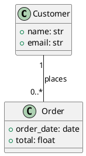

# Convert PlantUML to BESSER and generate a FastAPI backend

Good news: BESSER can ingest your PlantUML directly via `plantuml_to_buml()`, and the `BackendGenerator` produces a FastAPI app (plus matching Pydantic + SQLAlchemy modules) from any `DomainModel`. You can restrict it to only `GET` and `POST` endpoints with the `http_methods` parameter.

## 1. Install BESSER

```bash
python -m venv venv
# Windows:
venv\Scripts\activate
# macOS/Linux:
source venv/bin/activate

pip install besser
```

Python 3.10+ is required.

## 2. Save your PlantUML

Save your diagram as `ecommerce.plantuml` next to the script you'll run:



This is fully within the supported PlantUML subset:
- Two classes with public (`+`) primitive attributes.
- A binary association `Customer "1" -- "0..*" Order` with cardinality literals — exactly the form `plantuml_to_buml` handles.

## 3. Convert PlantUML to a B-UML `DomainModel` and generate the backend

Create `generate_backend.py`:

```python
from besser.BUML.notations.structuralPlantUML import plantuml_to_buml
from besser.generators.backend import BackendGenerator

# 1. Convert PlantUML -> B-UML DomainModel
model = plantuml_to_buml("ecommerce.plantuml")

# 2. (Optional but recommended) validate before generating
assert model.validate()["success"]

# 3. Generate FastAPI backend with only GET and POST endpoints
gen = BackendGenerator(
    model=model,
    output_dir="./output_backend",
    http_methods=["GET", "POST"],   # <-- restricts endpoints to read + create
    nested_creations=False,         # set True to allow nested objects in POST payloads
)
gen.generate()
```

Run it:

```bash
python generate_backend.py
```

## 4. What you get

Inside `./output_backend/` the `BackendGenerator` produces:

- `main_api.py` — the FastAPI app with `GET` and `POST` routes for `Customer` and `Order` (plus the `places` association handled via foreign keys on `Order`).
- `pydantic_classes.py` — request/response schemas.
- `sql_alchemy.py` — ORM models (the `1 -- 0..*` translates to a foreign key from `Order` to `Customer`).

`PUT` and `DELETE` are omitted because you didn't list them. Spelling matters: invalid method names are silently filtered with a warning, so keep them uppercase as shown.

## 5. Run the API

From the output directory:

```bash
cd output_backend
pip install fastapi uvicorn sqlalchemy pydantic
uvicorn main_api:app --reload
```

Then open http://127.0.0.1:8000/docs for the interactive Swagger UI — you'll see only `GET` and `POST` routes, exactly as requested.

## 6. Iterating

BESSER is model-driven: when requirements change (new attribute, new class, new association), update `ecommerce.plantuml` and rerun `generate_backend.py`. **Each `generate()` overwrites the output directory** — that's intentional. Don't hand-edit `main_api.py` as your primary change; edit the model.

## Notes and gotchas

- `plantuml_to_buml()` takes a file path, not a string. If you only have the diagram in memory, write it to a temp file first.
- Constraints (OCL / stereotypes) and n-ary associations are ignored by the PlantUML importer. Your diagram uses neither, so you're fine.
- Names must be identifier-safe (no spaces, no hyphens). `Customer`, `Order`, `order_date`, `total` all comply.
- If you later want all CRUD endpoints, change `http_methods` to `["GET", "POST", "PUT", "DELETE"]`.
- If you want to allow creating a `Customer` with their `Order`s in a single POST body, set `nested_creations=True`.
