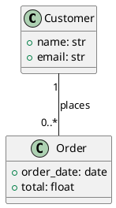

# Converting a PlantUML File to BESSER and Generating a FastAPI Backend (POST and GET Only)

BESSER provides two approaches for this workflow: (1) parsing your PlantUML file directly into a B-UML domain model, or (2) defining the model programmatically in Python. Both can then be fed into a generator that produces a FastAPI backend. Below you will find both approaches, with a focus on restricting the generated endpoints to **POST** and **GET** only.

---

## Approach 1: Parse the PlantUML File Directly

BESSER includes a built-in PlantUML-to-BUML parser that uses ANTLR to read `.plantuml` files and produce a `DomainModel` object. You can then pass that model to either the standalone `RESTAPIGenerator` or the full `BackendGenerator`.

### Step 1: Save Your PlantUML File

Save your PlantUML code as `ecommerce.plantuml`:



### Step 2: Parse and Generate

Create a Python script (e.g., `generate_ecommerce.py`) in the same directory as your `.plantuml` file:

```python
from besser.BUML.notations.structuralPlantUML import plantuml_to_buml
from besser.BUML.metamodel.structural import DomainModel
from besser.generators.backend import BackendGenerator

# Step 1: Parse PlantUML into a B-UML domain model
ecommerce_model: DomainModel = plantuml_to_buml(
    plantUML_model_path="ecommerce.plantuml"
)

# Step 2: Generate FastAPI backend with only GET and POST endpoints
backend = BackendGenerator(
    model=ecommerce_model,
    http_methods=["GET", "POST"],
    output_dir="./output_backend"
)
backend.generate()
```

Run the script:

```bash
python generate_ecommerce.py
```

This will create three files in `./output_backend/`:

- **`main_api.py`** -- The FastAPI REST API with GET and POST endpoints only (no PUT, DELETE)
- **`sql_alchemy.py`** -- SQLAlchemy ORM models with proper foreign keys and relationships
- **`pydantic_classes.py`** -- Pydantic validation schemas for request/response bodies
- **`requirements.txt`** -- Python dependencies needed to run the backend

### Step 3: Run the Generated Backend

```bash
cd output_backend
pip install -r requirements.txt
python main_api.py
```

The server will start at `http://127.0.0.1:8000`. Visit `http://127.0.0.1:8000/docs` for the interactive Swagger UI documentation.

---

## Approach 2: Define the Model Programmatically (No PlantUML File Needed)

If you prefer not to use a PlantUML file, you can define the same model directly in Python using B-UML metamodel classes. This gives you more control over details like multiplicity bounds and association end names.

```python
from besser.BUML.metamodel.structural import (
    DomainModel, Class, Property, Multiplicity,
    BinaryAssociation, StringType, FloatType, DateType
)
from besser.generators.backend import BackendGenerator

# Define Customer class
customer_name = Property(name="name", type=StringType)
customer_email = Property(name="email", type=StringType)
customer = Class(name="Customer", attributes={customer_name, customer_email})

# Define Order class
order_date = Property(name="order_date", type=DateType)
total = Property(name="total", type=FloatType)
order = Class(name="Order", attributes={order_date, total})

# Define the association: Customer "1" -- "0..*" Order
customer_end = Property(
    name="customer",
    type=customer,
    multiplicity=Multiplicity(1, 1)
)
orders_end = Property(
    name="orders",
    type=order,
    multiplicity=Multiplicity(0, "*")
)
places_association = BinaryAssociation(
    name="places",
    ends={customer_end, orders_end}
)

# Create the domain model
ecommerce_model = DomainModel(
    name="ECommerce",
    types={customer, order},
    associations={places_association}
)

# Generate the FastAPI backend (GET and POST only)
backend = BackendGenerator(
    model=ecommerce_model,
    http_methods=["GET", "POST"],
    output_dir="./output_backend"
)
backend.generate()
```

---

## Approach 3: Standalone REST API (Without SQLAlchemy/Database)

If you want a simpler, in-memory REST API without a database layer, use the `RESTAPIGenerator` directly instead of `BackendGenerator`. This generates a single `rest_api.py` file with in-memory lists as data storage and a `pydantic_classes.py` for validation.

```python
from besser.BUML.notations.structuralPlantUML import plantuml_to_buml
from besser.generators.rest_api import RESTAPIGenerator

# Parse PlantUML
ecommerce_model = plantuml_to_buml(plantUML_model_path="ecommerce.plantuml")

# Generate standalone REST API with GET and POST only
rest_api = RESTAPIGenerator(
    model=ecommerce_model,
    http_methods=["GET", "POST"],
    output_dir="./output_rest"
)
rest_api.generate()
```

This produces:

- **`rest_api.py`** -- FastAPI app using in-memory lists (no database)
- **`pydantic_classes.py`** -- Pydantic models for request/response validation
- **`requirements.txt`** -- Dependencies

Run with:

```bash
cd output_rest
pip install -r requirements.txt
python rest_api.py
```

---

## What Gets Generated

### BackendGenerator Output (Approach 1 and 2)

The `BackendGenerator` orchestrates three sub-generators internally:

1. **`RESTAPIGenerator`** (with `backend=True`) -- Produces `main_api.py` using the `backend_fast_api_template.py.j2` Jinja2 template. This template creates a fully-featured FastAPI application with:
   - SQLAlchemy database session management
   - CORS middleware
   - Health check and statistics endpoints
   - CRUD endpoints filtered by your `http_methods` parameter

2. **`SQLAlchemyGenerator`** -- Produces `sql_alchemy.py` with ORM models including proper foreign key placement based on multiplicity (the "1" side of a 1-to-many gets the FK on the "many" side).

3. **`PydanticGenerator`** -- Produces `pydantic_classes.py` with Pydantic `BaseModel` classes for input validation, including relationship fields typed correctly (e.g., `customer: int` for a required FK, `Optional[List[int]]` for optional collections).

### Generated Endpoints (GET + POST only)

With `http_methods=["GET", "POST"]`, the generated `main_api.py` will include these endpoints for each entity:

| Method | Endpoint                     | Description                           |
|--------|------------------------------|---------------------------------------|
| GET    | `/{entity}/`                 | List all entities (supports `detailed` query param) |
| GET    | `/{entity}/count/`           | Get count of entities                 |
| GET    | `/{entity}/paginated/`       | Paginated listing with `skip`, `limit` |
| GET    | `/{entity}/search/`          | Search by attribute filters           |
| GET    | `/{entity}/{id}/`            | Get single entity by ID               |
| POST   | `/{entity}/`                 | Create a single entity                |
| POST   | `/{entity}/bulk/`            | Bulk create multiple entities         |

PUT and DELETE endpoints are excluded because they are not in the `http_methods` list.

---

## Key Parameters Explained

### `http_methods` (list)

Controls which HTTP method endpoints are generated. Allowed values: `"GET"`, `"POST"`, `"PUT"`, `"DELETE"`. Pass only the ones you need:

```python
http_methods=["GET", "POST"]  # Only GET and POST endpoints
```

### `nested_creations` (bool, default: `False`)

Controls how related entities are handled in POST requests:

- `False` (default): Related entities are linked by their ID. When creating an `Order`, you pass `customer: 5` (the ID of an existing Customer).
- `True`: Allows both linking by ID and creating nested entities inline in a single request.

### `output_dir` (str, optional)

Where to save generated files. Defaults to `./output_backend` for `BackendGenerator` or `./output` for `RESTAPIGenerator`.

### `docker_image` (bool, default: `False`)

Set to `True` to also generate a `Dockerfile` and helper script for containerization.

---

## Complete Working Example

Here is a single, self-contained script that parses the PlantUML and generates a FastAPI backend with only GET and POST:

```python
"""
E-Commerce Backend Generator
Parses a PlantUML class diagram and generates a FastAPI backend
with GET and POST endpoints only.
"""
import os
from besser.BUML.notations.structuralPlantUML import plantuml_to_buml
from besser.BUML.metamodel.structural import DomainModel
from besser.generators.backend import BackendGenerator

# Write the PlantUML file
plantuml_content = """@startuml
class Customer {
  + name: str
  + email: str
}
class Order {
  + order_date: date
  + total: float
}
Customer "1" -- "0..*" Order : places
@enduml"""

plantuml_file = "ecommerce.plantuml"
with open(plantuml_file, "w") as f:
    f.write(plantuml_content)

# Parse PlantUML into B-UML domain model
ecommerce_model: DomainModel = plantuml_to_buml(
    plantUML_model_path=plantuml_file
)

# Verify the parsed model
print("Classes found:")
for cls in ecommerce_model.get_classes():
    print(f"  - {cls.name}")
    for attr in cls.attributes:
        print(f"      {attr.name}: {attr.type}")

print("\nAssociations found:")
for assoc in ecommerce_model.associations:
    print(f"  - {assoc.name}")

# Generate FastAPI backend with GET and POST endpoints only
backend = BackendGenerator(
    model=ecommerce_model,
    http_methods=["GET", "POST"],
    output_dir="./output_backend"
)
backend.generate()

print("\nGenerated files in ./output_backend/:")
for f in os.listdir("./output_backend"):
    print(f"  - {f}")
```

Save this as `generate_ecommerce.py` and run:

```bash
python generate_ecommerce.py
```

Then start the server:

```bash
cd output_backend
pip install -r requirements.txt
python main_api.py
```

Open `http://127.0.0.1:8000/docs` in your browser to see and test the generated GET and POST endpoints interactively via the Swagger UI.

---

## Relevant Source Files

Key files in the BESSER codebase for this workflow:

- **PlantUML parser**: `besser/BUML/notations/structuralPlantUML/plantuml_to_buml.py`
- **BackendGenerator**: `besser/generators/backend/backend_generator.py`
- **RESTAPIGenerator**: `besser/generators/rest_api/rest_api_generator.py`
- **REST API template (backend)**: `besser/generators/rest_api/templates/backend_fast_api_template.py.j2`
- **REST API template (standalone)**: `besser/generators/rest_api/templates/fast_api_template.py.j2`
- **SQLAlchemy generator**: `besser/generators/sql_alchemy/`
- **Pydantic generator**: `besser/generators/pydantic_classes/`
- **Library example** (similar workflow): `tests/BUML/metamodel/structural/library/library.py`
- **Documentation**: `docs/source/generators/backend.rst` and `docs/source/generators/rest_api.rst`
