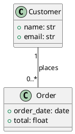

I now have everything needed. The user's PlantUML is fully supported (classes, attributes with `+ name: str`, and a `"1" -- "0..*"` association). Let me write the complete answer.

Here is the complete, practical answer based on the BESSER skill.

---

## Converting your PlantUML to BESSER and generating a FastAPI backend

Good news: your diagram uses only constructs that BESSER's PlantUML importer supports — classes, public attributes (`+ name: str`), and a `"1" -- "0..*"` association with cardinality literals. No rewriting needed.

The flow is two steps: **PlantUML → B-UML DomainModel** (`plantuml_to_buml`), then **DomainModel → FastAPI** (`BackendGenerator`). For POST and GET only, you pass `http_methods=["GET", "POST"]`.

### 1. Setup

```bash
python -m venv venv
# Windows:
venv\Scripts\activate
# macOS/Linux:
source venv/bin/activate

pip install besser
```

Verify the install:

```bash
python -c "from besser.BUML.metamodel.structural import DomainModel; print('OK')"
```

Python 3.10+ is required.

### 2. Save your PlantUML

Save your diagram exactly as-is to a file, e.g. `ecommerce.plantuml`:



One naming note from BESSER: model names become identifiers in generated code, so avoid spaces/hyphens. Your class and attribute names are already clean (`Customer`, `order_date`, etc.), so you're fine.

### 3. Convert and generate (one script)

`plantuml_to_buml()` takes a **file path** and returns a `DomainModel`. That model is the source of truth and can feed any generator — here, `BackendGenerator`, which produces FastAPI + SQLAlchemy + Pydantic in one shot. Restricting `http_methods` to `["GET", "POST"]` gives you read + create endpoints only.

```python
from besser.BUML.notations.structuralPlantUML import plantuml_to_buml
from besser.generators.backend import BackendGenerator

# 1. PlantUML -> B-UML DomainModel
model = plantuml_to_buml("ecommerce.plantuml")

# 2. Validate before generating (catch model issues early)
assert model.validate()["success"]

# 3. DomainModel -> FastAPI backend, POST + GET only
gen = BackendGenerator(
    model=model,
    output_dir="./output_backend",
    http_methods=["GET", "POST"],   # only read + create endpoints
    nested_creations=False,         # set True to allow nested creates in payloads
)
gen.generate()
# Produces: main_api.py, pydantic_classes.py, sql_alchemy.py
```

A couple of things worth knowing from the skill:

- Invalid method names are silently filtered (with a warning log), so double-check spelling — `"GET"`/`"POST"`, uppercase.
- `nested_creations=True` would let you create an `Order` together with its `Customer` in a single payload; with `False` you create them separately.
- Each `generate()` call **overwrites** the output directory — that's by design, since the model is the source of truth. Never hand-edit the generated files as your primary change; if requirements change, edit the PlantUML (or the model) and regenerate.

### 4. What you get and how the relationship maps

The output directory will contain three files:

- `main_api.py` — the FastAPI app, with GET and POST endpoints for `Customer` and `Order`.
- `pydantic_classes.py` — request/response schemas.
- `sql_alchemy.py` — the ORM layer.

Your `Customer "1" -- "0..*" Order` association translates into a **foreign key** on the `Order` side (a 1-to-many relationship), so each order references its customer.

### 5. Run and verify

```bash
cd output_backend
pip install -r requirements.txt
uvicorn main_api:app --reload
```

Then open `http://localhost:8000/docs` for the interactive Swagger UI — you should see only the GET and POST routes you asked for. Quick verification checklist from the skill:

1. The three files exist in `output_backend/`.
2. Syntax parses: `python -c "import ast; ast.parse(open('main_api.py').read())"`.
3. It runs (the `uvicorn` command above).
4. The 1..* relationship shows up as a foreign key from `Order` to `Customer`.

### Notes / alternatives

- **Inline string instead of a file:** `plantuml_to_buml()` needs a path, so if your PlantUML lives in a Python string, write it to a temp file first:
  ```python
  from pathlib import Path
  Path("ecommerce.plantuml").write_text(plantuml_text)
  model = plantuml_to_buml("ecommerce.plantuml")
  ```
- **Need PUT/DELETE later?** Just widen the list: `http_methods=["GET", "POST", "PUT", "DELETE"]` and regenerate.
- **Want a full web app (React UI + FastAPI + Docker) instead of just the API?** That's the `WebAppGenerator`, but it additionally requires a `GUIModel` — out of scope for a backend-only request, but available from the same `DomainModel`.

Relevant skill files consulted: `C:/Users/sulejmani/Desktop/besser-skills/skills/besser-user/SKILL.md` and `C:/Users/sulejmani/Desktop/besser-skills/skills/besser-user/references/plantuml.md`.