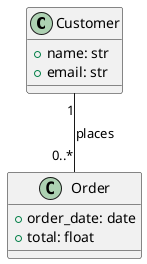

# Converting PlantUML to a FastAPI Backend with BESSER

BESSER makes this straightforward: you convert your PlantUML file into a B-UML domain model, then run the `BackendGenerator` to produce a complete FastAPI backend with SQLAlchemy ORM and Pydantic schemas.

## Step 1: Save Your PlantUML File

Save your PlantUML definition to a file, for example `ecommerce.plantuml`:



## Step 2: Install BESSER

```bash
python -m venv venv
# Windows:
venv\Scripts\activate
# macOS/Linux:
source venv/bin/activate

pip install besser
```

Verify the installation:

```bash
python -c "from besser.BUML.metamodel.structural import DomainModel; print('OK')"
```

## Step 3: Convert PlantUML to B-UML and Generate the FastAPI Backend

Create a Python script (e.g., `generate_backend.py`):

```python
from besser.BUML.notations.structuralPlantUML import plantuml_to_buml
from besser.generators.backend import BackendGenerator

# Step 1: Convert PlantUML to a B-UML domain model
model = plantuml_to_buml("ecommerce.plantuml")

# Step 2: Validate the model before generating
result = model.validate()
print("Validation:", result)

# Step 3: Generate the FastAPI backend
gen = BackendGenerator(model=model, output_dir="./output_backend")
gen.generate()

print("Backend generated in ./output_backend/")
```

Run it:

```bash
python generate_backend.py
```

This produces three files in `./output_backend/`:

- **`main_api.py`** -- The FastAPI application with REST endpoints for `Customer` and `Order`
- **`sql_alchemy.py`** -- SQLAlchemy ORM models with the association between Customer and Order
- **`pydantic_classes.py`** -- Pydantic schemas for request/response validation

## Step 4: Run the Generated API

Install the backend dependencies and start the server:

```bash
cd output_backend
pip install fastapi uvicorn sqlalchemy pydantic
uvicorn main_api:app --reload
```

The API will be available at `http://127.0.0.1:8000`. You can explore the auto-generated interactive docs at `http://127.0.0.1:8000/docs`.

## Restricting to POST and GET Endpoints Only

The `BackendGenerator` generates a full CRUD API by default (GET, POST, PUT, DELETE). To restrict to only POST and GET endpoints, edit the generated `main_api.py` after generation and remove the PUT and DELETE route handlers.

Alternatively, you can automate this by writing a post-processing script:

```python
import re

with open("./output_backend/main_api.py", "r") as f:
    content = f.read()

# Remove PUT endpoint blocks
content = re.sub(r'@app\.put\(.*?\n(?:.*?\n)*?(?=\n@app\.|\nif __name__|$)', '', content)

# Remove DELETE endpoint blocks
content = re.sub(r'@app\.delete\(.*?\n(?:.*?\n)*?(?=\n@app\.|\nif __name__|$)', '', content)

with open("./output_backend/main_api.py", "w") as f:
    f.write(content)

print("PUT and DELETE endpoints removed. Only GET and POST remain.")
```

## Alternative: Build the Model in Python (No PlantUML File Needed)

If you prefer to define everything in Python without a separate `.plantuml` file, here is the equivalent approach:

```python
from besser.BUML.metamodel.structural import (
    DomainModel, Class, Property, Multiplicity,
    BinaryAssociation, StringType, FloatType, DateType
)
from besser.generators.backend import BackendGenerator

# Define classes
name = Property(name="name", type=StringType)
email = Property(name="email", type=StringType)
customer = Class(name="Customer", attributes={name, email})

order_date = Property(name="order_date", type=DateType)
total = Property(name="total", type=FloatType)
order = Class(name="Order", attributes={order_date, total})

# Define association: Customer 1 -- 0..* Order
customer_end = Property(name="customer", type=customer, multiplicity=Multiplicity(1, 1))
orders_end = Property(name="places", type=order, multiplicity=Multiplicity(0, "*"))
places = BinaryAssociation(name="places", ends={customer_end, orders_end})

# Assemble the model
model = DomainModel(
    name="Ecommerce_model",
    types={customer, order},
    associations={places},
)

# Validate
result = model.validate()
print("Validation:", result)

# Generate FastAPI backend
gen = BackendGenerator(model=model, output_dir="./output_backend")
gen.generate()

print("Backend generated in ./output_backend/")
```

## What Gets Generated

The `BackendGenerator` produces a complete, runnable FastAPI backend:

| File | Purpose |
|------|---------|
| `main_api.py` | FastAPI app with REST endpoints for each class (GET list, GET by ID, POST create) |
| `sql_alchemy.py` | SQLAlchemy ORM models -- `Customer` and `Order` tables with the foreign key relationship |
| `pydantic_classes.py` | Pydantic schemas used for request body validation and response serialization |

## Verification Checklist

After generating, verify:

1. **Files exist** -- check `./output_backend/` for the three expected files
2. **Syntax is valid** -- `python -c "import ast; ast.parse(open('./output_backend/main_api.py').read())"`
3. **Run it** -- `cd output_backend && uvicorn main_api:app --reload`
4. **Test relationships** -- verify the Customer-Order foreign key was generated correctly in `sql_alchemy.py`
5. **Test endpoints** -- use the interactive Swagger docs at `/docs` to POST a Customer, then POST an Order linked to that Customer, and GET both back

## Key Principles

- **Model is the source of truth.** When requirements change, update the PlantUML file (or Python model) and regenerate.
- **Regeneration overwrites.** Generated files are replaced on each `generate()` call, so do not make permanent hand-edits to generated files.
- **Validate early.** Always call `model.validate()` before generating to catch issues like missing types or invalid associations.
- **One model, many targets.** The same domain model can feed multiple generators. For example, you could also run `SQLAlchemyGenerator` or `PydanticGenerator` on the same model for different outputs.
