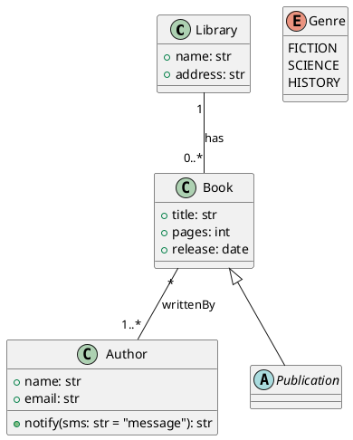

# Working with BESSER

BESSER is a model-driven platform: you describe your domain as a model, then generators
turn that model into running code. The model is always the source of truth — when
requirements change, you update the model and regenerate.

## Core Workflow

```
1. Define requirements
2. Build a B-UML model (Python API or PlantUML or web editor)
3. Pick a generator for your target platform
4. Generate code
5. Verify the output (run, test, inspect)
6. Iterate: update the model, regenerate
```

Never hand-edit generated code as the primary change — update the model instead.
Generated files are overwritten on each generation cycle.

---

## Installation

```bash
python -m venv venv
# Windows:
venv\Scripts\activate
# macOS/Linux:
source venv/bin/activate

pip install besser
# OR for the latest development version:
git clone https://github.com/BESSER-PEARL/BESSER.git
cd BESSER
pip install -e .
```

Verify the install:

```bash
python -c "from besser.BUML.metamodel.structural import DomainModel; print('OK')"
```

---

## Building a Domain Model (Structural)

A domain model contains **classes**, **associations**, **generalizations**, and
**enumerations**. Everything descends from `NamedElement` — names must not contain
spaces or hyphens (use underscores).

### Imports

```python
from besser.BUML.metamodel.structural import (
    DomainModel, Class, Property, Multiplicity,
    BinaryAssociation, Generalization,
    Enumeration, EnumerationLiteral,
    Method, Parameter,
    StringType, IntegerType, FloatType, BooleanType,
    DateType, DateTimeType, TimeType, TimeDeltaType,
    UNLIMITED_MAX_MULTIPLICITY,  # 9999, means "many"
)
```

### Classes and Attributes

```python
# Primitive type singletons: StringType, IntegerType, FloatType, BooleanType,
# DateType, DateTimeType, TimeType, TimeDeltaType
# You can also pass type as a string: "str", "int", "float", "bool", etc.

title = Property(name="title", type=StringType)
pages = Property(name="pages", type=IntegerType)
book = Class(name="Book", attributes={title, pages})

# Mark a primary key
book_id = Property(name="id", type=IntegerType, is_id=True)
# Only one is_id per class
```

### Enumerations

```python
genre = Enumeration(name="Genre", literals={
    EnumerationLiteral(name="FICTION"),
    EnumerationLiteral(name="SCIENCE"),
    EnumerationLiteral(name="HISTORY"),
})
# Use as attribute type:
book_genre = Property(name="genre", type=genre)
# Access literals: genre.FICTION, genre.SCIENCE
# Default values: Property(name="genre", type=genre, default_value=genre.FICTION)
```

### Associations

Associations connect two classes. Each end is a `Property` whose `type` is the
target class and whose `multiplicity` defines cardinality.

```python
# Multiplicity(min, max)  — max can be "*" or UNLIMITED_MAX_MULTIPLICITY
located_in = Property(name="locatedIn", type=library, multiplicity=Multiplicity(1, 1))
has_books  = Property(name="has",       type=book,    multiplicity=Multiplicity(0, "*"))

lib_book = BinaryAssociation(name="lib_book", ends={located_in, has_books})
```

Common cardinalities:
| Pattern | Multiplicity |
|---------|-------------|
| Exactly one | `Multiplicity(1, 1)` |
| Optional | `Multiplicity(0, 1)` |
| One or more | `Multiplicity(1, "*")` |
| Zero or more | `Multiplicity(0, "*")` |

For composition (whole-part ownership), set `is_composite=True` on the "whole" end.

### Inheritance

```python
person = Class(name="Person", attributes={name_prop, email_prop})
employee = Class(name="Employee", attributes={salary_prop})
gen = Generalization(general=person, specific=employee)
# employee inherits person's attributes
```

### Methods

```python
from besser.BUML.metamodel.structural import Method, Parameter

greet = Method(
    name="greet",
    parameters=[Parameter(name="message", type=StringType)],
    type=StringType,  # return type
    is_abstract=False,
)
person.add_method(greet)
```

### Assembling the Model

```python
model = DomainModel(
    name="Library_model",
    types={library, book, author, genre},
    associations={lib_book, book_author},
    generalizations={gen},
)

# Validate
result = model.validate()
# Returns {"success": True/False, "errors": [...], "warnings": [...]}
```

### Complete Example

```python
from besser.BUML.metamodel.structural import (
    DomainModel, Class, Property, Multiplicity,
    BinaryAssociation, StringType, IntegerType, DateType
)

# Classes
library_name = Property(name="name", type=StringType)
address = Property(name="address", type=StringType)
library = Class(name="Library", attributes={library_name, address})

title   = Property(name="title",   type=StringType)
pages   = Property(name="pages",   type=IntegerType)
release = Property(name="release", type=DateType)
book    = Class(name="Book", attributes={title, pages, release})

author_name = Property(name="name",  type=StringType)
email       = Property(name="email", type=StringType)
author      = Class(name="Author", attributes={author_name, email})

# Associations
located_in = Property(name="locatedIn", type=library, multiplicity=Multiplicity(1, 1))
has        = Property(name="has",       type=book,    multiplicity=Multiplicity(0, "*"))
lib_book   = BinaryAssociation(name="lib_book", ends={located_in, has})

publishes  = Property(name="publishes", type=book,   multiplicity=Multiplicity(0, "*"))
written_by = Property(name="writtenBy", type=author, multiplicity=Multiplicity(1, "*"))
book_author = BinaryAssociation(name="book_author", ends={written_by, publishes})

# Model
library_model = DomainModel(
    name="Library_model",
    types={library, book, author},
    associations={lib_book, book_author},
)
```

---

## Alternative: PlantUML Notation

Instead of building models in Python, you can write PlantUML and convert:

```python
from besser.BUML.notations.structuralPlantUML import plantuml_to_buml

model = plantuml_to_buml("my_model.plantuml")
```

Supported PlantUML syntax:



Visibility markers: `+` public, `-` private, `#` protected, `~` package.
Cardinality: `"1"`, `"0..*"`, `"1..*"`, `"*"`.
Inheritance: `Parent <|-- Child` or `class Child extends Parent`.
Composition: `*--` or `--*`.

---

## Picking a Generator

| Goal | Generator | Input | Output |
|------|-----------|-------|--------|
| Python classes | `PythonGenerator` | DomainModel | `classes.py` |
| Java classes | `JavaGenerator` | DomainModel | `.java` files (ZIP) |
| Pydantic models | `PydanticGenerator` | DomainModel | `pydantic_classes.py` |
| SQLAlchemy ORM | `SQLAlchemyGenerator` | DomainModel | `sql_alchemy.py` |
| Raw SQL DDL | `SQLGenerator` | DomainModel | `tables.sql` |
| JSON Schema | `JSONSchemaGenerator` | DomainModel | `json_schema.json` |
| FastAPI backend | `BackendGenerator` | DomainModel | ZIP (API + ORM + Pydantic) |
| Django app | `DjangoGenerator` | DomainModel + optional GUIModel | Django project (ZIP) |
| Full-stack web app | `WebAppGenerator` | DomainModel + GUIModel | React + FastAPI + Docker (ZIP) |
| Conversational agent | `BAFGenerator` | Agent model | Agent script + config (ZIP) |
| Quantum circuit | `QiskitGenerator` | QuantumCircuit | `qiskit_circuit.py` |
| RDF vocabulary | `RDFGenerator` | DomainModel | `vocabulary.ttl` |
| Terraform infra | `TerraformGenerator` | DeploymentModel | `.tf` files per cluster |
| Neural network | `PytorchGenerator` / `TFGenerator` | NN model | PyTorch/TF script |
| Flutter app | `FlutterGenerator` | DomainModel + GUIModel | Dart files |

### Decision guide

- **Just need data classes?** `PythonGenerator` or `PydanticGenerator`
- **Need a database?** `SQLAlchemyGenerator` (ORM) or `SQLGenerator` (raw DDL)
- **Need a REST API?** `BackendGenerator` gives you FastAPI + SQLAlchemy + Pydantic in one shot
- **Need a full web app?** `WebAppGenerator` gives you React frontend + FastAPI backend + Docker Compose — but you need both a DomainModel and a GUIModel
- **Need Django specifically?** `DjangoGenerator` builds a complete Django project
- **Building a chatbot?** Model it as an `Agent` (state machine) and use `BAFGenerator`

---

## Running a Generator

All generators follow the same pattern:

```python
from besser.generators.python_classes import PythonGenerator

generator = PythonGenerator(model=my_model, output_dir="./output")
generator.generate()
# Output written to ./output/classes.py
```

If `output_dir` is omitted, output goes to `<cwd>/output/`.

### SQLAlchemy with a specific DBMS

```python
from besser.generators.sql_alchemy import SQLAlchemyGenerator

gen = SQLAlchemyGenerator(model=my_model, output_dir="./output")
gen.generate(dbms="postgresql")  # sqlite, postgresql, mysql, mssql, mariadb, oracle
```

### FastAPI Backend

```python
from besser.generators.backend import BackendGenerator

gen = BackendGenerator(
    model=my_model,
    output_dir="./output_backend",
    http_methods=["GET", "POST", "PUT", "DELETE"],  # control which endpoints are generated
    nested_creations=False,  # True to allow nested object creation in payloads
)
gen.generate()
# Produces: main_api.py, pydantic_classes.py, sql_alchemy.py
```

To generate only GET and POST endpoints (no PUT/DELETE):

```python
gen = BackendGenerator(
    model=my_model,
    output_dir="./output_backend",
    http_methods=["GET", "POST"],
)
gen.generate()
```

### Django

```python
from besser.generators.django import DjangoGenerator

gen = DjangoGenerator(
    model=my_model,
    project_name="myproject",
    app_name="myapp",
    output_dir="./output",
)
gen.generate()
```

### Full-Stack Web App

Requires both a DomainModel and a GUIModel:

```python
from besser.generators.web_app import WebAppGenerator

gen = WebAppGenerator(
    model=domain_model,
    gui_model=gui_model,
    output_dir="./webapp_output",
    agent_model=None,  # optional Agent for chatbot
)
gen.generate()
# Produces: frontend/ (React), backend/ (FastAPI), docker-compose.yml
# Run with: cd webapp_output && docker-compose up --build
```

---

## Using the Web Editor

The visual editor at https://editor.besser-pearl.org lets you build models
graphically and generate code without writing Python.

1. Create a new diagram (Class Diagram, State Machine, GUI, etc.)
2. Add classes, attributes, associations visually
3. Click "Generate" and pick your target generator
4. Download the generated code

The editor uses the same generators as the Python API — the backend converts
your visual diagram to a B-UML model, runs the generator, and streams the result.

---

## State Machine Modeling

For behavioral modeling (e.g., workflows, chatbots):

```python
from besser.BUML.metamodel.state_machine.state_machine import (
    StateMachine, Body, Event, Condition, CustomCodeAction
)

sm = StateMachine(name="OrderProcess")
initial = sm.new_state(name="pending", initial=True)
confirmed = sm.new_state(name="confirmed")
shipped = sm.new_state(name="shipped")

# Transitions
confirm_event = Event(name="confirm")
initial.when_event(confirm_event).go_to(confirmed)

ship_event = Event(name="ship")
confirmed.when_event(ship_event).go_to(shipped)

# State behavior
confirmed.set_body(Body(
    name="send_email",
    actions=[CustomCodeAction(source="session.reply('Order confirmed!')")]
))
```

---

## Agent (Chatbot) Modeling

Agents extend state machines with NLP capabilities:

```python
from besser.BUML.metamodel.state_machine.agent import (
    Agent, AgentReply, LLMReply,
    WebSocketPlatform,
)
from besser.BUML.metamodel.state_machine.state_machine import Body

agent = Agent(name="helpdesk")
agent.use_websocket_platform()

# States
initial = agent.new_state(name="initial", initial=True)
greeting = agent.new_state(name="greeting")
fallback = agent.new_state(name="fallback")

# Intents (NLP training data)
hello = agent.new_intent(
    name="hello_intent",
    training_sentences=["Hi", "Hello", "Hey there", "Good morning"],
)

# Transitions based on intent matching
initial.when_intent_matched(hello).go_to(greeting)
initial.when_no_intent_matched().go_to(fallback)

# Behaviors
greeting.set_body(Body(name="greet", actions=[
    AgentReply(message="Hello! How can I help you today?"),
]))
fallback.set_body(Body(name="fallback", actions=[
    AgentReply(message="Sorry, I didn't understand. Can you rephrase?"),
]))

# Auto-return to initial
greeting.go_to(initial)
fallback.go_to(initial)

# Generate
from besser.generators.agents import BAFGenerator
gen = BAFGenerator(model=agent, output_dir="./agent_output")
gen.generate()
```

---

## GUI Modeling (for WebAppGenerator / DjangoGenerator)

GUI models define screens, data bindings, and navigation. They are required
by `WebAppGenerator` and optional for `DjangoGenerator`.

### Imports

```python
from besser.BUML.metamodel.gui import (
    GUIModel, Module, Screen,
    DataList, DataSourceElement,
    Button, ButtonType, ButtonActionType,
)
```

### Data Binding with DataSourceElement and DataList

`DataSourceElement` binds a domain class to a UI list, selecting which fields
to display. `DataList` groups one or more data sources into a displayable list.

```python
# Bind the Book class — show title and pages columns
book_source = DataSourceElement(
    name="book_list",
    dataSourceClass=book,        # reference to a Class from your DomainModel
    fields={title, pages},       # reference to Property objects from that Class
)

# Bind the Author class — show name and email
author_source = DataSourceElement(
    name="author_list",
    dataSourceClass=author,
    fields={author_name, email},
)

# Create display lists
book_list = DataList(name="BookList", description="Shows books", list_sources={book_source})
author_list = DataList(name="AuthorList", description="Shows authors", list_sources={author_source})
```

### Screens and Navigation

```python
# Main page — mark one screen as is_main_page=True
home = Screen(
    name="Home",
    description="Home page",
    view_elements={book_list},
    is_main_page=True,
)

# Additional screens
authors_page = Screen(
    name="Authors",
    description="Author management",
    view_elements={author_list},
)
```

### Assembling the GUI Model

```python
module = Module(name="main", screens={home, authors_page})
gui = GUIModel(
    name="MyApp",
    package="com.example",
    versionCode="1",
    versionName="1.0",
    description="Library app",
    modules={module},
)
```

### Using with WebAppGenerator

```python
from besser.generators.web_app import WebAppGenerator

gen = WebAppGenerator(
    model=domain_model,   # your DomainModel
    gui_model=gui,        # the GUIModel above
    output_dir="./webapp",
)
gen.generate()
# Run with: cd webapp && docker-compose up --build
```

**Common pitfall:** If no screen has `is_main_page=True`, the generated app
will have no landing page. Django prints a warning; WebApp may render an
empty page.

---

## Verification Checklist

After generating code, verify:

1. **Files exist** — check the output directory for expected files
2. **Syntax is valid** — for Python: `python -c "import ast; ast.parse(open('output/classes.py').read())"`
3. **Run it** — for backends: `cd output && pip install -r requirements.txt && uvicorn main_api:app`
4. **Test relationships** — verify associations translated correctly (foreign keys, join tables)
5. **Check edge cases** — enumerations, optional fields, inheritance hierarchies
6. **Docker** — for WebApp: `cd output && docker-compose up --build`

---

## Key Principles

- **Model is the source of truth.** All changes flow from model to code, never the reverse.
- **Regeneration overwrites.** Generated files are replaced on each `generate()` call. Don't make manual edits you want to keep in generated files.
- **Validate early.** Call `model.validate()` before generating to catch issues like missing types or circular inheritance.
- **One model, many targets.** The same DomainModel can feed multiple generators — Python classes, SQL, REST API, etc.
- **Names matter.** B-UML names become identifiers in generated code. Use `snake_case` for attributes, `PascalCase` for classes, no spaces or hyphens.
