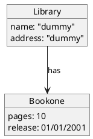

# B-UML Object (Instance) Model Reference

An *object model* instantiates a structural `DomainModel`: it holds concrete
`Object`s (instances of `Class`), their attribute values (`DataValue` held in
`AttributeLink` slots), and `Link`s between them (instances of an
`Association`). BESSER mainly uses object models to validate/test a structural
model — e.g. evaluating OCL constraints against concrete data. Read this when
the user wants to build instances, set attribute values, or wire links against
an existing class model.

## Table of contents

- [Imports](#imports)
- [Key classes](#key-classes)
- [Two ways to build](#two-ways-to-build)
- [Fluent API (recommended)](#fluent-api-recommended)
- [Explicit/verbose API](#explicitverbose-api)
- [Assembling and validating the model](#assembling-and-validating-the-model)
- [Reading attributes and links back](#reading-attributes-and-links-back)
- [objectPlantUML notation](#objectplantuml-notation)
- [Gotchas](#gotchas)

## Imports

```python
from besser.BUML.metamodel.object import (
    ObjectModel, Object, Instance,
    AttributeLink, DataValue,
    Link, LinkEnd,
)
# Fluent builder (only needed if you instantiate it directly)
from besser.BUML.metamodel.object.builder import ObjectBuilder
```

`from besser.BUML.metamodel.object import *` also works — the package
re-exports everything from its `object.py` module. Object models always sit on
top of a structural model, so you will also import from
`besser.BUML.metamodel.structural` (`Class`, `Property`, `StringType`, etc.).

## Key classes

| Class | One-liner |
|-------|-----------|
| `ObjectModel(name, objects=None)` | Root container. `objects` is a `set[Object]` (defaults to empty `set()`). |
| `Object(name, classifier, slots=None)` | An instance of a `Class`. `classifier` is the `Class`; `slots` is a `list[AttributeLink]` (defaults to `[]`). |
| `Instance(name, classifier)` | Base of `Object` and `DataValue`; pairs a name with its `classifier` (a `Type`). |
| `AttributeLink(value, attribute)` | A named slot: binds a `DataValue` to a structural `Property`. Note the param order is `value` first. |
| `DataValue(classifier, value, name="")` | The typed value in a slot. `classifier` is the attribute's `Type`; `value` is the raw Python value. |
| `Link(name, association, connections)` | An instance of an `Association`. `connections` is a `list[LinkEnd]`. |
| `LinkEnd(name, association_end, object, owner=None)` | One end of a link: ties an association end (`Property`) to a target `Object`. |
| `ObjectBuilder(classifier)` | Fluent builder; usually obtained via `MyClass("obj_name")`, not constructed directly. |

## Two ways to build

You build objects against an **existing** `DomainModel` — the structural
`Class` objects and association-end `Property` objects are your handles. There
are two equivalent APIs.

## Fluent API (recommended)

Calling a `Class` instance like a function returns an `ObjectBuilder`
(`Class.__call__(instance_name)` → `ObjectBuilder(self).name(instance_name)`).
Chain `.attributes(...)`, `.link(...)`, then `.build()`:

```python
# Given structural classes Team, Player and an association end named "plays_for"
team = Team("team1").attributes(name="Lakers", city="LA", division="West").build()

player = (
    Player("player1")
    .attributes(name="LeBron", age=38, position="Forward", jerseyNumber=6)
    .link(team, "plays_for")          # end_name is the association-end Property name
    .build()
)

assert player.name == "Lakers" is False  # player.name == "LeBron"
assert player.plays_for == team
```

- `.attributes(**kwargs)` — keys are attribute (`Property`) names of the class
  (inherited attributes are allowed); values are raw Python values. Each
  becomes an `AttributeLink` with a `DataValue`.
- `.link(target_obj, end_name)` — `end_name` is the **target** association
  end's name. `target_obj` may be a single `Object` or a `set` of `Object`s
  (for to-many ends). Raises `ValueError` if `end_name` is not an association
  end of the class.
- `.build()` — returns the `Object`. Raises `ValueError` if no name was set.

## Explicit/verbose API

Construct each piece by hand. This mirrors what the builder does and is what
the official `tests/.../library_object.py` example uses:

```python
import datetime
from besser.BUML.metamodel.object import (
    Object, AttributeLink, DataValue, Link, LinkEnd, ObjectModel,
)
from besser.BUML.metamodel.structural import StringType, IntegerType, DateType

# --- attribute slots ---
# AttributeLink(value, attribute): `attribute` is the structural Property,
# `value` is a DataValue whose classifier must equal the attribute's type.
book_title = AttributeLink(
    value=DataValue(classifier=StringType, value="Book title"),
    attribute=title,            # `title` is the Property from the class model
)
book_pages = AttributeLink(
    value=DataValue(classifier=IntegerType, value=100),
    attribute=pages,
)
book_obj = Object(name="Book_Object", classifier=book, slots=[book_title, book_pages])

author_obj = Object(name="Author_Object", classifier=author, slots=[
    AttributeLink(value=DataValue(classifier=StringType, value="John Doe"), attribute=author_name),
])

# --- a link (instance of book_author_association) ---
# Each LinkEnd binds an association end (Property) to an object.
book_end   = LinkEnd(name="book_end",   association_end=publishes,  object=book_obj)
author_end = LinkEnd(name="author_end", association_end=written_by, object=author_obj)
author_book_link = Link(
    name="author_book_link",
    association=book_author_association,
    connections=[book_end, author_end],
)
```

You do **not** add `Link`s to the `ObjectModel` directly — creating a `Link`
registers it on the objects it connects (via the `connections` setter), and
`ObjectModel.links` is derived from the objects' link sets.

## Assembling and validating the model

```python
object_model = ObjectModel(name="Object_model", objects={book_obj, author_obj})

# objects can also be added incrementally:
object_model.add_object(book_obj)

result = object_model.validate()
# {"success": True/False, "errors": [...], "warnings": [...]}
```

`ObjectModel.validate(raise_exception=True)` checks: unique object names,
well-formed links (all association ends instantiated, ends belong to the
association, referenced objects in the model, type conformance including
inheritance), association-end **multiplicity** bounds, and **enumeration**
attribute values against valid literals. It *warns* (not errors) about objects
with no attribute values. With `raise_exception=True` (default) it raises
`ValueError` on any error; pass `raise_exception=False` to just get the dict.

Useful derived properties:
- `object_model.objects` → `set[Object]`
- `object_model.instances` → `set[Object | DataValue]` (objects + their data values)
- `object_model.links` → `set[Link]` (collected from all objects)

## Reading attributes and links back

`Object` overrides attribute access so you can read/write by attribute or
association-end name:

```python
book_obj.pages            # -> 100 (the DataValue's value, unwrapped)
book_obj.pages = 250      # updates the existing slot's value
author_obj.publishes      # -> the linked Object, or a set of Objects for to-many
```

The object's own **identifier** is exposed two ways: `obj.name` returns the
value of a `name` *attribute* if the class has one (otherwise the identifier),
while `obj.name_` always returns the internal object name passed to the
constructor. In the fluent example above, `player.name_ == "player1"` but
`player.name == "LeBron"` because `Player` has a `name` attribute. Prefer
`name_` when you need the object's stable identifier.

## objectPlantUML notation

`besser/BUML/notations/objectPlantUML/` contains only ANTLR-generated
artifacts — `ODLexer`, `ODParser`, `ODListener` (grammar `OD.g4`) — and **no**
high-level convenience function (there is no `object_plantuml_to_buml`
analogous to the structural `plantuml_to_buml`). To parse you wire ANTLR up by
hand:

```python
from antlr4 import FileStream, CommonTokenStream, ParseTreeWalker
from besser.BUML.notations.objectPlantUML.ODLexer import ODLexer
from besser.BUML.notations.objectPlantUML.ODParser import ODParser
from besser.BUML.notations.objectPlantUML.ODListener import ODListener

all_objs = []
stream = CommonTokenStream(ODLexer(FileStream("model.plantuml")))
parser = ODParser(stream)
tree = parser.objectDiagram()
ParseTreeWalker().walk(ODListener(all_objs), tree)   # populates all_objs
```

Supported PlantUML object-diagram syntax (from `OD.g4`):



Object header is `Object <name>` (optionally `Object <name> : <ClassName>`);
slots are `key: value` (string, number, or `dd/mm/yyyy` date); link operators
are `<|--`, `o--`, `--`, `..`, `-->`, `..>` with an optional `: linkName`.

> **This notation is effectively non-functional in v7.8.3.** Every test in
> `tests/BUML/notations/objectPlantUML/` is `@pytest.mark.skip`-ed with the
> reason *"The PlantUML parser for Object models dont create DataValue objects,
> we need to fix it."* The listener builds `Object`s with `classifier="not
> found"` (a string, not a resolved `Class`), stores raw text as
> `AttributeLink` values instead of `DataValue`s, and creates `Link`s with
> `association=None`. Such objects will not pass `ObjectModel.validate()`.
> For real work, build object models with the Python API above. (The BESSER
> docs also show the import path `besser.BUML.notations.od.*`, which does
> **not** exist — the real package is `besser.BUML.notations.objectPlantUML`.)

## Gotchas

- **`AttributeLink` param order is `(value, attribute)`** — `value` first.
- **`DataValue.classifier` must equal the attribute's type.** `AttributeLink`'s
  setter raises `TypeError` on mismatch (e.g. attribute typed `int` but the
  `DataValue.classifier` is `StringType`).
- **`DataValue` validates primitive value types.** For a `PrimitiveDataType`
  classifier the raw value must be the matching Python type
  (`str`→`str`, `int`→`int`, `float`→`float`, `bool`→`bool`, `date`→
  `datetime.date`, `datetime`→`datetime.datetime`, `time`→`datetime.time`,
  `timedelta`→`datetime.timedelta`, `any`→any `object`); otherwise `TypeError`.
- **`ObjectModel(... objects=...)`**, not `instances=`. The constructor keyword
  is `objects` (a `set`); `instances` is a read-only derived property. (The
  BESSER docs show `instances={...}` — that is wrong.)
- **Don't put `Link`s in the model.** Constructing a `Link` auto-registers it on
  its connected objects; `ObjectModel.links` is computed from those objects.
- **`obj.name` vs `obj.name_`.** If the class has a `name` attribute, `obj.name`
  returns that attribute value, not the object identifier — use `obj.name_` for
  the identifier.
- **Builder is per-class via `__call__`.** `MyClass("id")` returns an
  `ObjectBuilder`; you rarely construct `ObjectBuilder(...)` directly.
