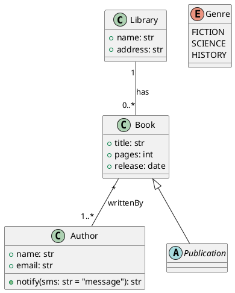

# PlantUML to B-UML Reference

BESSER converts a subset of PlantUML class-diagram syntax to a B-UML
`DomainModel`. Read this when the user has a `.plantuml` or `.puml` file and
wants to skip the Python metamodel API.

## Conversion call

```python
from besser.BUML.notations.structuralPlantUML import plantuml_to_buml

model = plantuml_to_buml("my_model.plantuml")
# `model` is a DomainModel — feed it to any generator
```

The function takes a path to a file. To convert an inline string, write it
to a temp file first:

```python
from pathlib import Path
Path("model.plantuml").write_text(plantuml_text)
model = plantuml_to_buml("model.plantuml")
```

## Supported syntax



### Visibility markers

| Marker | Meaning |
|--------|---------|
| `+` | public |
| `-` | private |
| `#` | protected |
| `~` | package |

### Cardinality literals

`"1"`, `"0..1"`, `"0..*"`, `"1..*"`, `"*"` — all accepted on either end of
a `--` association line. Quotes are required.

### Inheritance and composition

| Notation | Meaning |
|----------|---------|
| `Parent <|-- Child` | Child inherits from Parent |
| `class Child extends Parent` | Same, alternative syntax |
| `Whole *-- Part` | Composition (Whole owns Part) |
| `Whole --* Part` | Composition (Part is owned by Whole) |

## Gotchas

- Only structural diagrams are supported. State machines, sequence diagrams,
  and use-case diagrams are not handled — model those with the Python API.
- N-ary associations (more than two ends) are not supported. PlantUML allows
  them syntactically but `plantuml_to_buml` only emits `BinaryAssociation`.
- Constraints (OCL or stereotypes) are ignored. Add them in Python after
  conversion if needed.

## Round-trip

Once you have a `DomainModel`, you can feed it to any generator without
caring whether it came from PlantUML or Python — the metamodel is the same
either way.
